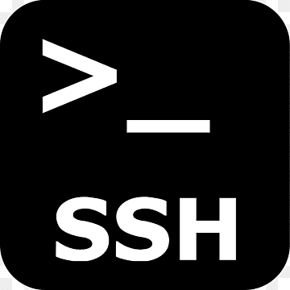

# SSH Troubleshoot Skill

<div style="display: flex; align-items: center;">
  
  <span style="width: 40px;">       </span>
  
</div>

<br>

This skill helps diagnose and resolve SSH connection issues with a Compute Engine instance on Google Cloud Plateform (GCP).
It runs a series of automated checks to identify common problems related to VM status, network configuration, and permissions.

## Prerequisites

### Tools
- Python 3.11.9
- Google Cloud SDK 551.0.0

### Authentification
This script uses two different authentication methods:
- **Application Default Credentials (ADC)** for the Python client libraries to make API calls.
- **gcloud CLI authentication** for the `gcloud compute ssh` command.

You must perform both authentications for the script to work correctly.

1.  **Log in with Application Default Credentials:**
    This allows the Python code to check the VM status, firewall rules, and IAM permissions.

    ```bash
    gcloud auth application-default login
    ```

2.  **Log in with your user account for the gcloud CLI:**
    This allows the script to run the `gcloud compute ssh` command to test the connection.

    ```bash
    gcloud auth login
    ```

3.  **Set the Quota Project:**
    Replace `<PROJECT_ID>` with the ID of the GCP project that will be used for billing and API quotas.

    ```bash
    gcloud auth application-default set-quota-project <PROJECT_ID>
    ```

## Install the skill

```bash
# Install all skills to Claude Code, Cursor, Codex, or any supported agent
npx skills add emmanueldrecqpro-coder/gcp-ssh-troubleshoot

# Or clone directly
git clone https://github.com/emmanueldrecqpro-coder/gcp-ssh-troubleshoot.git ~/.skills/gcp-ssh-troubleshoot
```


## Use the skill


1. Write a sentence to ask agent cli to test a ssh connection \
**User** : "I want you to test the ssh connection to a VM"

<br>

2. Agent recognizes the request matches the ssh-troubleshooter description and asks for permission to activate it.  \
**Agent** : "I will activate the ssh-troubleshoot skill to help you test the SSH connection to your VM." \
Action required : User must approve skill activation

<br>

3. User provide informations to troubleshoot ssh connection  \
**User** : project id : <PROJECT_ID>, instance: <INSTANCE_ID>, zone: <ZONE_NAME>

<br>

4. Agent execute python script.
**Agent** : "I will now run the troubleshooting script for the VM <INSTANCE_ID> in project <PROJECT_ID> and zone <ZONE_NAME>."  \
Action required : User must approve python script execution

## How It Works

The script performs the following automated checks in order:

1.  **Check VM Status:** Verifies that the VM instance is in the `RUNNING` state.

2.  **Check Firewall Rules:** Checks the project's firewall rules to ensure that an ingress rule allows SSH traffic (TCP port 22) to the VM's network.

3.  **Check IAP Permissions:** Tests if the currently authenticated user has the necessary IAM permissions for IAP (Identity-Aware Proxy) tunneling.

4.  **Check IAP Configuration:** Checks if the VM is configured to allow IAP tunneling by verifying the `enable-oslogin` metadata key.

5.  **Attempt SSH Connection:** Tries to connect to the VM using `gcloud compute ssh`. If the connection fails, it analyzes the error output to provide specific recommendations.

Based on the results of these checks, the script will print diagnostic information and suggest commands or actions to help you resolve the SSH issue.
